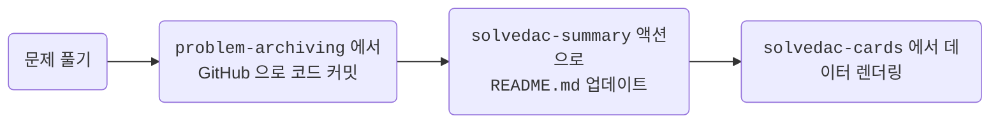

<!-- START AUTO-UPDATE -->

## 레이팅 변화

## 스트릭

## 태그별 통계

## 난이도 분포

<!-- END AUTO-UPDATE -->

## 자동 업데이트 파이프라인

```mermaid
flowchart LR
  solve(문제 풀기)
  detect(<code>problem-archiving</code> 에서<br>GitHub 으로 코드 커밋)
  action(<code>solvedac-summary</code> 액션으로<br><code>README.md</code> 업데이트)
  show(<code>solvedac-cards</code> 에서 데이터 렌더링)

  solve --> detect --> action --> show
```
